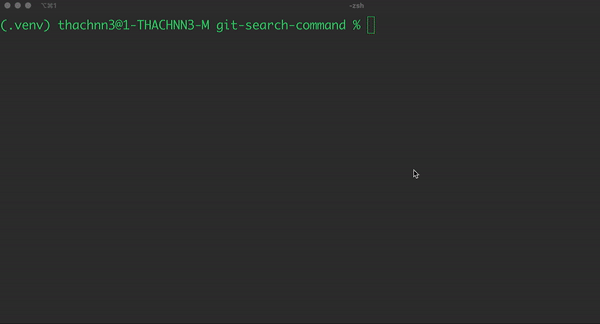
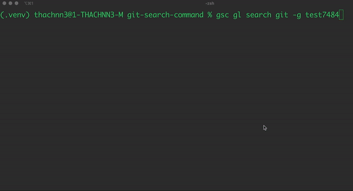
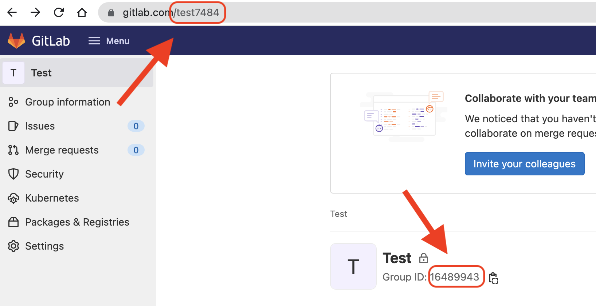

# GITLAB SEARCH COMMAND TOOLS

[](https://pypi.org/project/git-search-command/)
[](https://github.com/nguyen-ngoc-thach/git-search-command/commits/main)
[](https://github.com/psf/black)
[](https://github.com/nguyen-ngoc-thach/git-search-command/actions)
[](https://github.com/pre-commit/pre-commit)
[](https://github.com/nguyen-ngoc-thach/git-search-command/blob/main/LICENSE)

A simple tool to search the expression in the project scope for GitLab and GitHub repositories.

## Prerequisites

1. Install [Python3+](https://www.python.org/downloads/).
2. Create a [personal GitLab access token](https://docs.gitlab.com/ee/user/project/settings/project_access_tokens.html) and store it in a secure place.

## Installation

```
python -m pip install --upgrade pip
python -m pip install git-search-command
```

## Environment

After finishing the installation you need to create new environment for searching

```
gsc gl env --new <environment_name>
```

Then input your host name and personal token as following


See more

```
gsc gl env --help

Usage: gsc gl env [OPTIONS]

  Setup the environment for searching, support multiple environments.

Options:
  -n, --new <environment>      Create new or override the env information if
                               it was existed.
  -d, --default <environment>  Set the environment as default.
  -r, --remove <environment>   Remove the environment.
  -i, --info <environment>     Display the environment info.
  -l, --list                   List all environment.
  -h, --help                   Show this message and exit.
```

## Usage

### Search in project



```
gsc gl search <keywork> --project <project_id>
```

You can find project ID as below image


### Search in group



```
gsc gl search <keywork> --group <group_id_or_group_path>
```

You can search in group using id or path name. You refer the below image to get them.



See more

```
$ gsc gl search --help

Usage: gsc gl search [OPTIONS] <keyword>

  Search the content in GitLab repositories.

Options:
  -g, --group <int>           Search in the specified project group, input
                              group id or group path.
  -p, --project <int>         Search in the specified project, input project
                              id.
  -e, --environment <string>  Select the environment for searching, if not
                              declare, default environment has been used.
  -v                          Show result preview, available only when
                              searching project, not in group.
  -o, --output <file_path>    Export the search result to file, only support
                              text file.
  -h, --help                  Show this message and exit.
```

## Development

### Environments

1. [Python 3.7+](https://www.python.org)
2. [Visual Studio Code](https://code.visualstudio.com) with [Python](https://marketplace.visualstudio.com/items?itemName=ms-python.python) extension.

### Setup

#### Terminal

Create and activate the virtual environment

```
python -m venv .venv
source .venv/bin/activate
```

Then install the dependencies for development environment

```
python -m pip install -e .[develop]
```

#### Vscode task

1. `Ctrl Shift B` to select `Tasks: Run Task`
2. Run `Install DEV environment` task

### Build

#### Terminal

```
python setup.py -v build install
```

#### Vscode task

Run `Build Project` task.

## License

[Apache](https://github.com/nguyen-ngoc-thach/git-search-command/blob/main/LICENSE)

## Reference documents

### GitLab

- [API Project](https://docs.gitlab.com/ee/api/projects.html)
- [API Group](https://docs.gitlab.com/ee/api/groups.html)
- [API Search](https://docs.gitlab.com/ee/api/search.html)