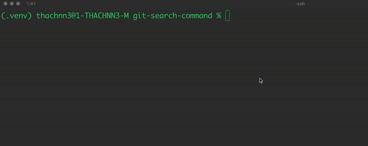
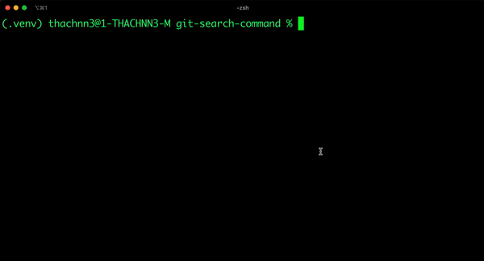
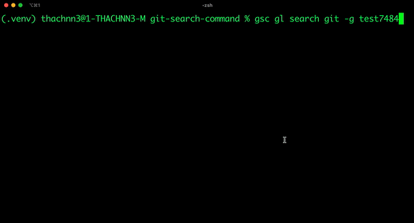
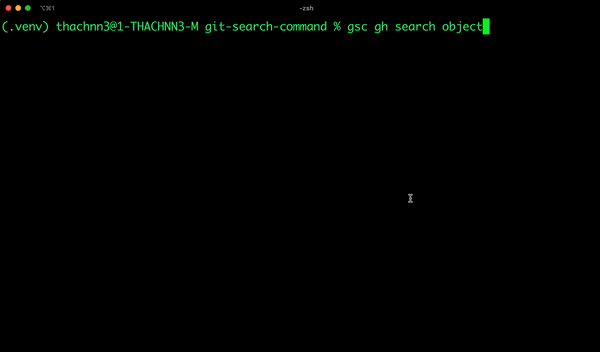
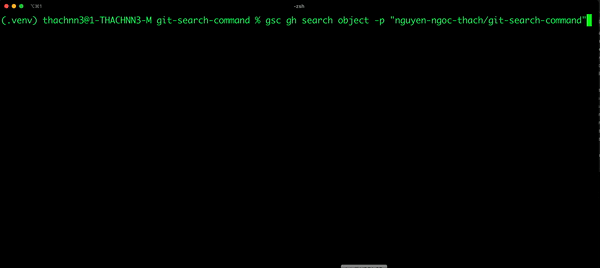

# GIT SEARCH COMMAND

[](https://pypi.org/project/git-search-command/)
[](https://github.com/jamesnguyen46/git-search-command/commits/)
[](https://codecov.io/gh/jamesnguyen46/git-search-command)
[](https://github.com/jamesnguyen46/git-search-command/actions/workflows/push_pull_request.yml)
[](https://github.com/jamesnguyen46/git-search-command/blob/main/LICENSE)

A simple tool to search the content in files for your GitLab and GitHub repositories.

> This project has been implemented for PERSONAL USE. If you want more advanced features like creating issue, pull request ... may be refer to use [GLab](https://github.com/profclems/glab) or [GitHub CLI](https://github.com/cli/cli)

## Prerequisites

1. Install [Python3.7+](https://www.python.org/downloads/).
2. Create a personal access token on [GitLab](https://docs.gitlab.com/ee/user/project/settings/project_access_tokens.html) or [GitHub](https://docs.github.com/en/authentication/keeping-your-account-and-data-secure/creating-a-personal-access-token).

## Installation

```
python -m pip install --upgrade pip
python -m pip install git-search-command
```

## Usage

### Environment

After finishing the installation you need to create new environment for searching

```
gsc gl env --new <environment_name>
```

Then input your host name and personal token as following



### Search in GitLab

```
gsc gl search <keywork> --project <project_id>
```



```
gsc gl search <keywork> --group <group_id_or_group_path>
```



### Search in GitHub

Default is to search all repositories that you owned, not fork repository.

```
gsc gh search <keywork>
```



```
gsc gh search <keywork> --repository <repository_full_name>
```



### See more

Read the [wiki](https://github.com/jamesnguyen46/git-search-command/wiki) for the detail of `gsc` commands.

## License

[Apache](https://github.com/jamesnguyen46/git-search-command/blob/main/LICENSE)
